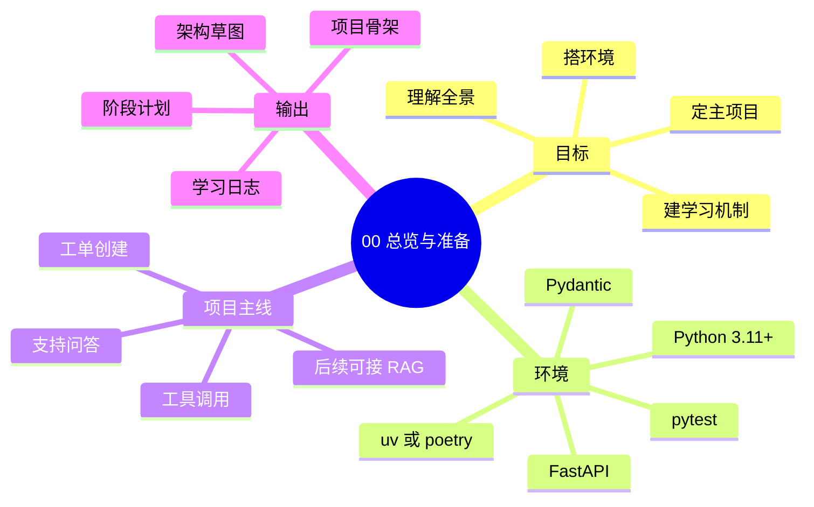

# 00 总览与准备思维导图

```mermaid
mindmap
  root((00 总览与准备))
    目标
      理解全景
      搭环境
      定主项目
      建学习机制
    环境
      Python 3.11+
      uv 或 poetry
      FastAPI
      Pydantic
      pytest
    项目主线
      支持问答
      工具调用
      工单创建
      后续可接 RAG
    输出
      项目骨架
      学习日志
      架构草图
      阶段计划
```
