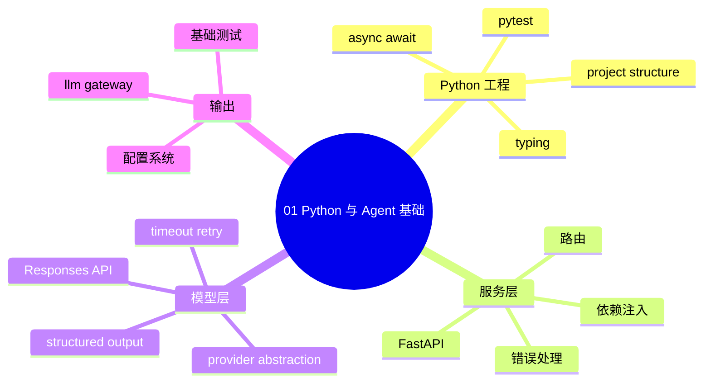

# 01 Python 与 Agent 基础思维导图

```mermaid
mindmap
  root((01 Python 与 Agent 基础))
    Python 工程
      typing
      async await
      project structure
      pytest
    服务层
      FastAPI
      路由
      依赖注入
      错误处理
    模型层
      Responses API
      structured output
      provider abstraction
      timeout retry
    输出
      llm gateway
      配置系统
      基础测试
```
