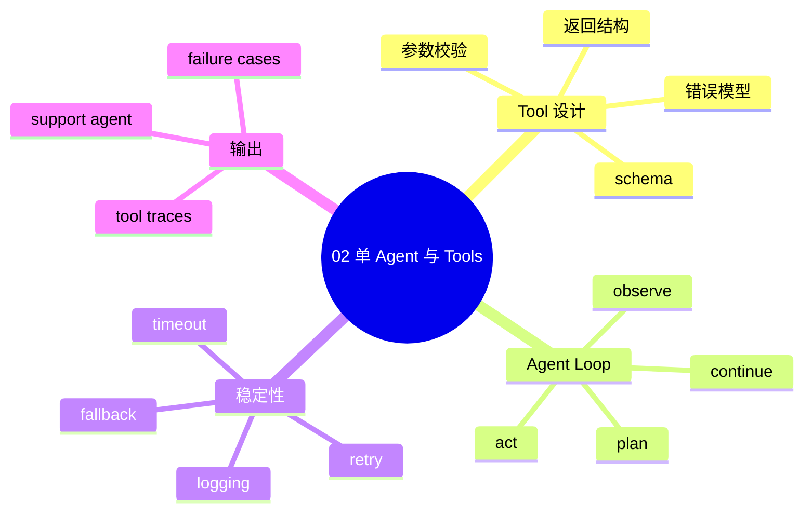

# 02 单 Agent 与 Tools思维导图

```mermaid
mindmap
  root((02 单 Agent 与 Tools))
    Tool 设计
      schema
      参数校验
      返回结构
      错误模型
    Agent Loop
      plan
      act
      observe
      continue
    稳定性
      retry
      timeout
      fallback
      logging
    输出
      support agent
      tool traces
      failure cases
```
