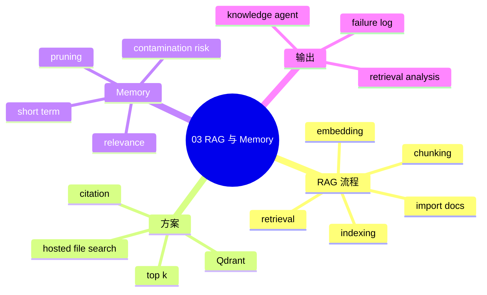

# 03 RAG、Memory 与 Knowledge思维导图

```mermaid
mindmap
  root((03 RAG 与 Memory))
    RAG 流程
      import docs
      chunking
      embedding
      indexing
      retrieval
    方案
      hosted file search
      Qdrant
      top k
      citation
    Memory
      short term
      pruning
      relevance
      contamination risk
    输出
      knowledge agent
      retrieval analysis
      failure log
```
