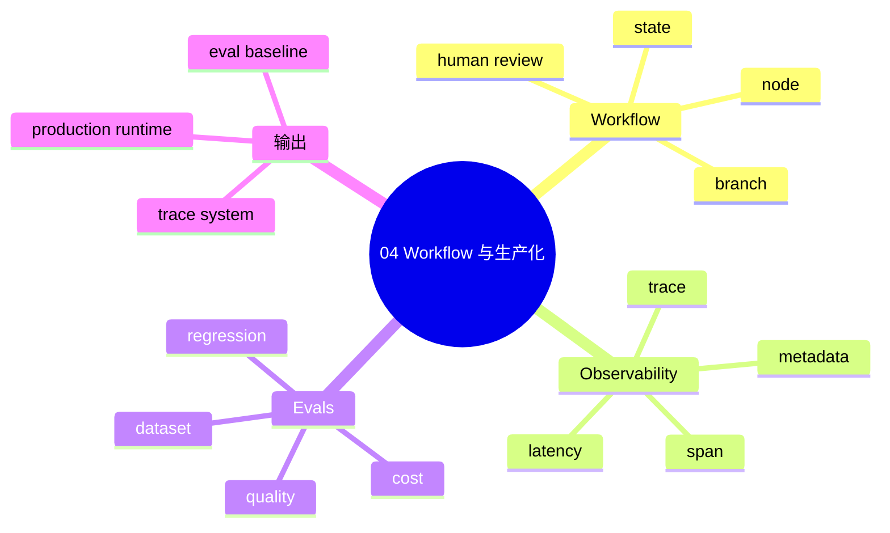

# 04 Workflow、Observability 与 Evals思维导图

```mermaid
mindmap
  root((04 Workflow 与生产化))
    Workflow
      state
      node
      branch
      human review
    Observability
      trace
      span
      metadata
      latency
    Evals
      dataset
      quality
      cost
      regression
    输出
      production runtime
      trace system
      eval baseline
```
