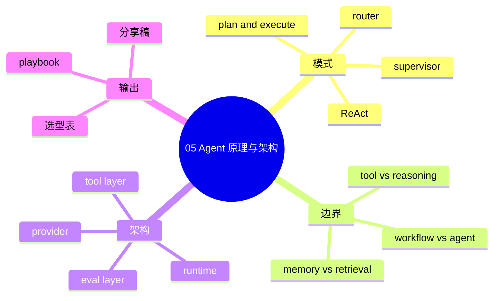

# 05 Agent 原理与架构思维导图

```mermaid
mindmap
  root((05 Agent 原理与架构))
    模式
      ReAct
      plan and execute
      router
      supervisor
    边界
      workflow vs agent
      memory vs retrieval
      tool vs reasoning
    架构
      provider
      runtime
      tool layer
      eval layer
    输出
      playbook
      选型表
      分享稿
```
