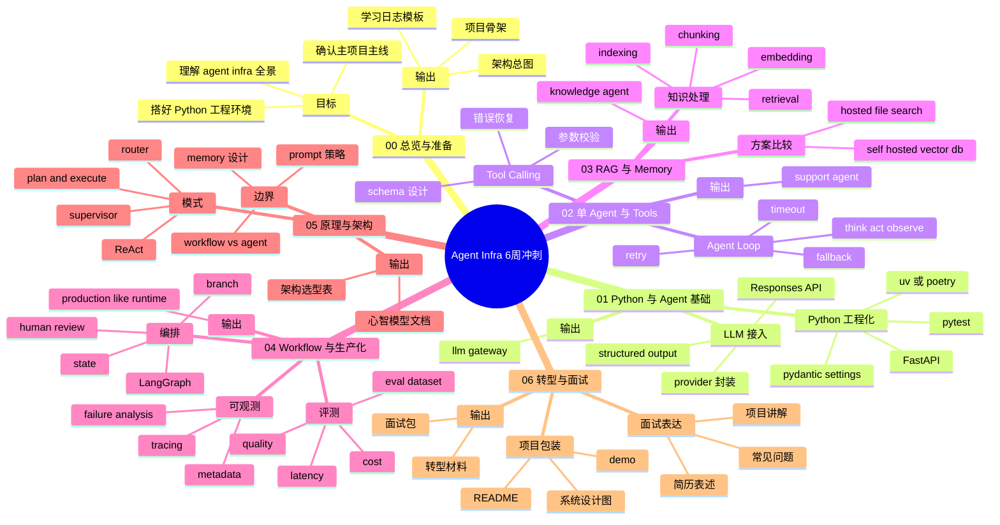

# Agent Infra 总思维导图

```mermaid
mindmap
  root((Agent Infra 6周冲刺))
    00 总览与准备
      目标
        理解 agent infra 全景
        搭好 Python 工程环境
        确认主项目主线
      输出
        学习日志模板
        项目骨架
        架构总图
    01 Python 与 Agent 基础
      Python 工程化
        uv 或 poetry
        pydantic settings
        pytest
        FastAPI
      LLM 接入
        Responses API
        structured output
        provider 封装
      输出
        llm gateway
    02 单 Agent 与 Tools
      Tool Calling
        schema 设计
        参数校验
        错误恢复
      Agent Loop
        think act observe
        retry
        timeout
        fallback
      输出
        support agent
    03 RAG 与 Memory
      知识处理
        chunking
        embedding
        indexing
        retrieval
      方案比较
        hosted file search
        self hosted vector db
      输出
        knowledge agent
    04 Workflow 与生产化
      编排
        LangGraph
        state
        branch
        human review
      可观测
        tracing
        metadata
        failure analysis
      评测
        eval dataset
        latency
        cost
        quality
      输出
        production like runtime
    05 原理与架构
      模式
        ReAct
        plan and execute
        router
        supervisor
      边界
        workflow vs agent
        memory 设计
        prompt 策略
      输出
        心智模型文档
        架构选型表
    06 转型与面试
      项目包装
        README
        demo
        系统设计图
      面试表达
        项目讲解
        常见问题
        简历表述
      输出
        面试包
        转型材料
```
