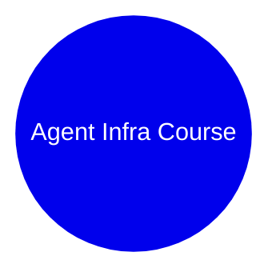

# Agent Infra Course Generation Implementation Plan

> **For agentic workers:** REQUIRED SUB-SKILL: Use superpowers:subagent-driven-development (recommended) or superpowers:executing-plans to implement this plan task-by-task. Steps use checkbox (`- [ ]`) syntax for tracking.

**Goal:** Generate a six-week Python-first agent infra learning course with one root overview, one overall mind map, and one document set plus one sub-mind-map for each stage.

**Architecture:** Create a root `agent-infra-course/` folder in the repository, place the overall program documentation at the root, then create one subfolder per stage with a consistent set of Markdown documents. Mind maps are written as Mermaid `mindmap` diagrams so the course can be read directly in Markdown viewers.

**Tech Stack:** Markdown, Mermaid

---

### Task 1: Create course structure

**Files:**
- Create: `agent-infra-course/`
- Create: `agent-infra-course/00-overview/`
- Create: `agent-infra-course/01-python-agent-foundations/`
- Create: `agent-infra-course/02-single-agent-with-tools/`
- Create: `agent-infra-course/03-rag-memory-and-knowledge/`
- Create: `agent-infra-course/04-workflow-observability-and-evals/`
- Create: `agent-infra-course/05-agent-theory-and-architecture/`
- Create: `agent-infra-course/06-career-transition-and-interview/`

- [ ] **Step 1: Verify target path is empty enough for generation**

Run: `find agent-infra-course -maxdepth 2 -type f | sort`
Expected: no files or only files created during this task

- [ ] **Step 2: Create the stage directories**

Run: `mkdir -p agent-infra-course/{00-overview,01-python-agent-foundations,02-single-agent-with-tools,03-rag-memory-and-knowledge,04-workflow-observability-and-evals,05-agent-theory-and-architecture,06-career-transition-and-interview}`
Expected: directories exist without errors

- [ ] **Step 3: Verify directory creation**

Run: `find agent-infra-course -maxdepth 1 -type d | sort`
Expected: root folder plus seven stage folders

### Task 2: Write root course documents

**Files:**
- Create: `agent-infra-course/README.md`
- Create: `agent-infra-course/mindmap.md`

- [ ] **Step 1: Write the course overview**

Add a Markdown guide that includes:

```md
# Agent Infra Learning Course

## Who this is for
- Backend engineers transitioning into Python-first agent infrastructure

## Program structure
- 6 weeks
- 8-12 hours per week
- project-driven progression
```

- [ ] **Step 2: Write the overall Mermaid mind map**

Add a Markdown file with:

```md

```

- [ ] **Step 3: Verify the root files were created**

Run: `find agent-infra-course -maxdepth 1 -type f | sort`
Expected: `README.md` and `mindmap.md`

### Task 3: Write module document sets

**Files:**
- Create: `agent-infra-course/<stage>/README.md`
- Create: `agent-infra-course/<stage>/tasks.md`
- Create: `agent-infra-course/<stage>/resources.md`
- Create: `agent-infra-course/<stage>/project.md`
- Create: `agent-infra-course/<stage>/review.md`
- Create: `agent-infra-course/<stage>/mindmap.md`

- [ ] **Step 1: Write stage summaries**

For each stage README, include:

```md
## Stage goal
## Outcomes
## Suggested weekly rhythm
## Completion checklist
```

- [ ] **Step 2: Write execution-oriented task lists**

For each `tasks.md`, include:

```md
## Day-by-day or block-by-block schedule
## Time budget
## Exit criteria
```

- [ ] **Step 3: Write supporting resources, project brief, review prompts, and sub-mind-map**

For each stage, add:

```md
## resources.md
- official docs
- what to read

## project.md
- project scope
- must-have items
- stretch goals

## review.md
- reflection prompts
- quality checklist

## mindmap.md

```

- [ ] **Step 4: Verify generated file count**

Run: `find agent-infra-course -type f | sort | wc -l`
Expected: more than 35 files only if extra docs were added, otherwise 44 including the root docs and this plan is excluded because it lives outside the course root

### Task 4: Validate syntax and structure

**Files:**
- Modify: `agent-infra-course/README.md` if issues are found
- Modify: `agent-infra-course/*/mindmap.md` if Mermaid formatting is broken

- [ ] **Step 1: Spot-check Mermaid blocks**

Run: `rg -n "^```mermaid|^mindmap|^  root" agent-infra-course`
Expected: each mind map file contains a valid Mermaid block

- [ ] **Step 2: Review the final tree**

Run: `find agent-infra-course -maxdepth 2 -type f | sort`
Expected: the root files and all per-stage files are present

- [ ] **Step 3: Commit if repository workflow requires it**

Run: `git add agent-infra-course docs/superpowers/plans/2026-04-02-agent-infra-course-generation.md`
Expected: files are staged
